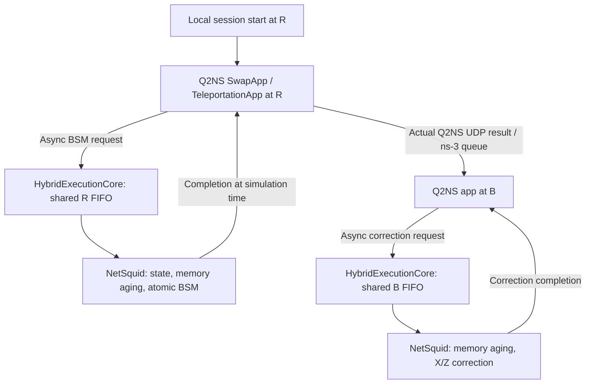

# Hybrid Quantum–Classical Network Simulator

**Q2NS/ns-3의 실제 classical protocol·packet 실행과 NetSquid의 quantum state evolution을 연결하는 공동 시뮬레이터.**

이 저장소는 `johnlimmm`의 hybrid simulator 구현과 검증 결과를 담는다.
현재 **Hybrid v2 (direct session start)**은 실제 Q2NS **SwapApp**과 **TeleportationApp**을 공통 실행 기반에 연결하고,
두 프로토콜의 혼합 실행에서 classical packet queue와 quantum processor queue가
실제 연산 시각 및 memory aging에 반영되는 것을 검증했다.

**상태: 230개 test cases PASS · Swap / Teleport / Mixed 실행 지원 · 독립 NetSquid reference 검증 완료**

## 이 프로젝트에서 구현한 것

| 구현 | 역할 | 주요 코드 |
|---|---|---|
| `HybridFederation` | ns-3와 NetSquid의 다음 이벤트 경계를 맞추고, 요청·완료의 인과 순서를 유지 | [hybrid_core.py](contrib/cosim/python/hybrid_core.py) |
| `HybridExecutionCore` | 정수 ns clock, shared R/B FIFO, session별 요청 식별, 자원 예약·해제 | [hybrid_core.py](contrib/cosim/python/hybrid_core.py) |
| `SwapAdapter` / `TeleportAdapter` | pair+pair→pair와 qubit+pair→qubit의 서로 다른 자원·연산 의미를 공통 core에 연결 | [hybrid_adapters.py](contrib/cosim/python/hybrid_adapters.py) |
| 실제 Q2NS 앱의 외부 실행 연결 | Q2NS가 protocol/UDP를 실행하고 NetSquid에 BSM·correction을 비동기로 요청 | [cosim-hybrid.cc](contrib/cosim/examples/cosim-hybrid.cc), [Q2NS patches](contrib/cosim/integrations/) |
| Native memory aging | 입력 qubit과 EPR을 NetSquid memory에 저장하고 실제 simulation time에 따라 T1/T2 noise 반영 | [adapters](contrib/cosim/python/hybrid_adapters.py) |
| 독립 검증 | packet FIFO·processor timing·자원 격리·causal log와 별도 NetSquid reference의 density matrix 비교 | [validation](contrib/cosim/python/hybrid_validation.py), [reference](contrib/cosim/python/netsquid_reference_hybrid.py) |
| 단순화 모델 비교 | Full Sync 대비 Fixed-Dc / No-Dq-R / Decoupled의 예측 오차 평가 | [P5-B 평가 코드](contrib/cosim/experiments/), [pilot 결과](contrib/cosim/README-P5B.md) |

ns-3, Q2NS, NetSquid 자체는 기존 프로젝트다. 이 저장소의 구현 범위는 그 사이의 실행·시간·자원 연결,
Q2NS 외부 실행 adapter, 시나리오 및 검증·평가 코드다.

## 실행 구조



- **Q2NS/ns-3**: 앱의 protocol 진행, 실제 payload, UDP, packet queue, 전송·전파 지연.
- **공통 core/federation**: 시간 동기화, processor 배정, 자원 lifecycle, 완료 전달과 로그.
- **NetSquid**: 유일한 quantum-state 소유자. Q2NS 외부 session에는 중복 Qubit/QState를 만들지 않는다.

각 quantum 연산은 지정된 duration 동안 자원과 processor를 점유하고 완료시각에 적용한다.
대기시간과 연산시간 동안의 memory aging을 포함하며, native timed QuantumProgram 모델은 아니다.

## 현재 실행할 수 있는 시나리오

| 시나리오 | 내용 | 설정 |
|---|---|---|
| Teleportation | 입력 qubit + EPR, 실제 결과 packet, Bob correction | [hybrid-teleport.json](contrib/cosim/scenarios/hybrid-teleport.json) |
| Mixed | Swap·Teleport가 같은 R/B processor를 공유하고 서로 대기시킴 | [hybrid-mixed.json](contrib/cosim/scenarios/hybrid-mixed.json) |
| Joint contention | 여러 Swap session의 quantum FIFO와 classical background traffic 결합 | [hybrid-swap-joint-result.json](contrib/cosim/scenarios/hybrid-swap-joint-result.json) |
| Simplification pilot | 네 실행/근사 모델을 동일 workload 조건에서 비교 | [p5b-pilot.json](contrib/cosim/scenarios/p5b-pilot.json) |

기본 Mixed 실행의 R 대기시간은 session 순서대로 **0 / 1.6 / 2.4 / 4.0 ms**다.
추가 fast-BSM 테스트에서는 B correction FIFO의 protocol 간 경합도 검증한다.

## 검증 결과와 새 평가

- **Python 140개 + timing/계측 7개 + Q2NS native 83개 = 230개 PASS**.
- 5개 Teleport 입력 상태 × 32 seeds에서 네 BSM branch를 다시 확인했다.
- Local 시작, R/B FIFO, native Q2NS result packet, completion callback, 자원 격리와 aging을 검증한다.
- P5-B pilot/expanded, native timing, 1–64 session 비용 측정을 새 구조로 재실행했다.
- [새 전체 검증 요약](contrib/cosim/results/direct-start-validation-summary.json)
- [현재 P5-B 평가](contrib/cosim/README-P5B.md), [논문용 수치·CI·그림](contrib/cosim/paper/RESULTS.md)
- [새 결과 원자료 압축본](contrib/cosim/baselines/direct-start-v2-results.tar.gz)과
  [복원·검증 방법](contrib/cosim/README-PAPER-VALIDATION.md#원자료-복원)

현재 topology는 **A/R/B**다. `session_start_ns`에 R의 Q2NS 앱이 BSM을 요청하며,
classical 통신은 실제 **R→B result UDP**다. Latency는 local session start부터 correction 완료까지다.

P0–P5-A/초기 Q2NS는 과거 command-path 구조의 regression fixture로 보존한다.
[Hybrid v1 release 기록](contrib/cosim/releases/hybrid-v1/)과
[v1 archive](contrib/cosim/baselines/hybrid-v1-freeze.tar.gz)는 이전 버전의 결과이며 현재 수치와 구분한다.

## 빠른 실행

검증 환경: **ns-3.47 / Python 3.7.17 / NetSquid 1.1.7 / NumPy 1.21.6**.
NetSquid가 설치된 Python 환경을 별도로 준비해야 한다. 이 저장소에 NetSquid를 재배포하지 않는다.

### 1. Q2NS 준비 — 새 checkout에서 한 번

저장소 루트에서 실행한다. 현재 개발 workspace에는 이미 적용되어 있으므로 재적용하지 않는다.

```bash
git clone https://github.com/QuantumInternet-it/q2ns.git contrib/q2ns
git -C contrib/q2ns checkout --detach f22ba28f437099ba3cf9956ca332ba5ce8bb14fd
git -C contrib/q2ns apply ../cosim/integrations/q2ns-swap-external.patch
git -C contrib/q2ns apply ../cosim/integrations/q2ns-teleport-external.patch
```

### 2. 빌드 및 Mixed 실행

```bash
./ns3 configure --enable-examples --enable-tests
CCACHE_TEMPDIR=/tmp/cosim-ccache ./ns3 build cosim-hybrid -j 1

# 자신의 NetSquid 환경에 맞게 Python 경로를 지정한다.
COSIM_PYTHON=/home/ns3/qunet/bin/python
"$COSIM_PYTHON" contrib/cosim/python/run_hybrid.py \
  contrib/cosim/scenarios/hybrid-mixed.json \
  --output /tmp/hybrid-mixed.json
```

`run_hybrid.py`가 ns-3 participant를 시작하고 IPC와 federation 실행을 관리한다.
Teleport 단독 실행은 설정을 `hybrid-teleport.json`으로 바꾸면 된다.
전체 회귀를 위한 추가 build target과 재현 절차는 [release 문서](contrib/cosim/RELEASE-HYBRID-V1.md)에 있다.

```bash
# 과거 v1 archive 검증 (현재 v2 source는 의도적으로 변경됨)
python3 contrib/cosim/tools/verify_hybrid_v1.py --archive-only

# 현재 구조를 포함한 전체 회귀
/home/ns3/qunet/bin/python contrib/cosim/tools/validate_direct_start.py
```

## 코드와 문서 읽는 순서

1. [README-HYBRID](contrib/cosim/README-HYBRID.md): 현재 실행 경로와 결과.
2. [SPEC-HYBRID](contrib/cosim/SPEC-HYBRID.md): 시간·자원·adapter 계약.
3. [run_hybrid.py](contrib/cosim/python/run_hybrid.py) → [hybrid_core.py](contrib/cosim/python/hybrid_core.py): 실제 federation 흐름.
4. [hybrid_adapters.py](contrib/cosim/python/hybrid_adapters.py) / [cosim-hybrid.cc](contrib/cosim/examples/cosim-hybrid.cc): quantum adapter와 Q2NS 앱 연결.
5. [test_hybrid.py](contrib/cosim/tests/test_hybrid.py): 동등성·branch·Mixed·실패 검출 사례.

`contrib/cosim/README.md` 및 이전 milestone 문서는 당시의 기준점을 기록한 문서다.
P0–P5-B의 구현·결과도 함께 보존하며, 현재 진입점은 이 README와 README-HYBRID다.

## 지원 범위와 다음 단계

**v2 지원 범위:** 고정 A/R/B 배치, IPv4/UDP, t=0에 생성한 input/EPR,
atomic BSM/correction, shared R/B FIFO, native T1/T2 aging, 최대 64 sessions.

임의 topology, dynamic EPR, physical quantum channel, 모든 Q2NS 예제의 무수정 실행은 아직 지원하지 않는다.
다음 milestone은 **E1: Scheduled EPR Provisioning**이다. EPR 준비를 기다리는 시간과
processor 대기를 분리하고, 미래 생성 이벤트를 federation에 연결한다.
이후 configurable topology → native quantum channel/generation → multi-hop 순으로 확장한다.

## 기반 프로젝트와 라이선스

- [ns-3](https://www.nsnam.org/): classical network simulator. 원본 설명은 [README-NS3.md](README-NS3.md)에 보존한다.
- [Q2NS](https://github.com/QuantumInternet-it/q2ns): quantum-network protocol 앱과 논리 자원 계층.
- [NetSquid](https://netsquid.org/): quantum state 및 native memory evolution.

ns-3 기반 소스를 함께 포함하며 원본의 라이선스와 저작자 표기를 유지한다.
이 저장소의 Git 이력은 프로젝트 게시용 단일 snapshot에서 시작한다.
게시 commit의 작성자가 포함된 upstream 소스 전체의 원저자라는 뜻은 아니다.
라이선스는 [LICENSE](LICENSE)를 참고한다.
