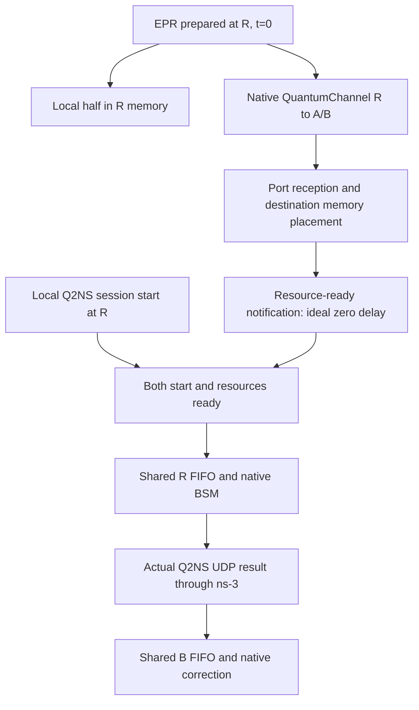

# Hybrid v4 — Quantum-channel resource provisioning

NetSquid `QuantumChannel`로 EPR remote half를 실제 전달하고, 수신 완료가 Swap/Teleport의
BSM eligibility를 결정한다. 기존 shared R/B FIFO, native gate chain, Q2NS UDP result 경로를 사용한다.



## 모델 범위

- EPR/input은 t=0에 준비하며, physical source나 확률적 생성 성공은 모델링하지 않는다.
- Quantum delivery는 무손실이다. 기본 channel noise는 0이고 native depolarization rate를 설정할 수 있다.
- 원격 도착을 R에 알리는 **준비 완료 통지 지연은 0**으로 가정한다. 실제 ACK/heralding packet은 아니다.
- `resource_wait_ns`와 `quantum_wait_ns`를 분리한다. 준비된 요청부터 FIFO에 진입한다.
- 이동 중 qubit에는 channel 모델을 적용하고, 목적지 memory aging은 실제 저장된 때부터 적용한다.
- A/R/B topology와 session별 memory position을 고정한다. 세부 계약은 [SPEC](SPEC-PROVISIONED.md)에 있다.

## 실행

v3와 동일한 NetSquid 환경 및 Q2NS patches를 사용한다. Q2NS 원본 코드는 추가 변경하지 않았다.
ns-3 루트에서:

```bash
./ns3 configure --enable-examples --enable-tests
CCACHE_TEMPDIR=/tmp/cosim-ccache ./ns3 build cosim-provisioned -j 1
/home/ns3/qunet/bin/python contrib/cosim/python/run_provisioned.py \
  contrib/cosim/scenarios/provisioned-mixed.json --output /tmp/provisioned-mixed.json.gz
```

일반 `.json`과 압축 `.json.gz`를 모두 출력할 수 있다. 예제는
[Teleport](scenarios/provisioned-teleport.json), [Mixed](scenarios/provisioned-mixed.json)다.
RA/RB는 quantum link이고 `result_link`/`background.result`는 ns-3 classical link다.

## 검증과 평가

- 새 provisioning 테스트 20개 + 기존 회귀 258개 = **278개 PASS**.
- 96개 조합, 192 transaction에서 독립 reference와 최대 density-matrix 오차 **4.44×10⁻¹⁶**.
- 별도 noiseless Teleport 160 transaction에서 5개 입력 상태 각각 네 BSM branch를 모두 통과했다.
- 채널 지연·잡음이 0이면 기존 v3 시각·상태와 일치한다. Memory noise를 켠 조건도 검사했다.

```bash
/home/ns3/qunet/bin/python -m unittest discover \
  -s contrib/cosim/tests -p test_provisioned.py -v

/home/ns3/qunet/bin/python contrib/cosim/experiments/run_provisioned_evaluation.py \
  contrib/cosim/scenarios/provisioned-evaluation.json \
  --output-dir contrib/cosim/results/provisioned-evaluation-new
```

완료된 평가 출력 경로는 재사용하지 않는다. 전체 회귀를 실행하는
`tools/validate_provisioned.py`는 이전에 publish한 결과를 byte 단위로 복원하며,
이번 재실행 로그와 변경된 결과 사본은 `results/provisioned-regression/`에 저장한다.
새 환경에서는 기존 milestone binary와 Q2NS native test-runner도 빌드되어 있어야 한다.

결과: [v4 검증 요약](results/provisioned-validation-summary.json),
[새 평가](results/provisioned-evaluation/summary.json), [전체 회귀](results/provisioned-regression/summary.json),
[논문용 provisioning 결과](paper/PROVISIONING.md).

새 원자료·로그·도표는 [압축본](baselines/provisioned-v4-results.tar.gz)과
[파일별 해시](baselines/provisioned-v4-results.json)로 보존하며, 압축 후 모든 파일의 byte 일치를 확인했다.
Git checkout에 원자료가 없다면 ns-3 루트에서 다음으로 복원한다. 기존 파일은 덮어쓰지 않는다.

```bash
sha256sum -c contrib/cosim/baselines/provisioned-v4-results.sha256
tar --skip-old-files -xzf contrib/cosim/baselines/provisioned-v4-results.tar.gz
```

## 구현 위치

- [quantum_network_backend.py](python/quantum_network_backend.py): 실제 node/channel, 전달·배치 callback.
- [provisioned_core.py](python/provisioned_core.py): readiness와 기존 native core/federation 연결.
- [cosim-provisioned.cc](examples/cosim-provisioned.cc): Q2NS readiness adapter와 기존 UDP packet 경로.
- [run_provisioned.py](python/run_provisioned.py): runner와 결과 생성.
- [reference](python/netsquid_reference_provisioned.py): 독립 network/circuit과 branch enumeration.
- [tests](tests/test_provisioned.py): channel/aging 경계, FIFO, async semantics와 v3 동등성.

v3는 [freeze manifest](baselines/native-v3-freeze.json)와 기존 commit/원자료 압축본으로 유지한다.
`paper/RESULTS.md`의 384조건 P5-B와 실행 비용 수치는 **v3**다.
v4의 channel provisioning 평가와 구분해서 읽어야 한다.
