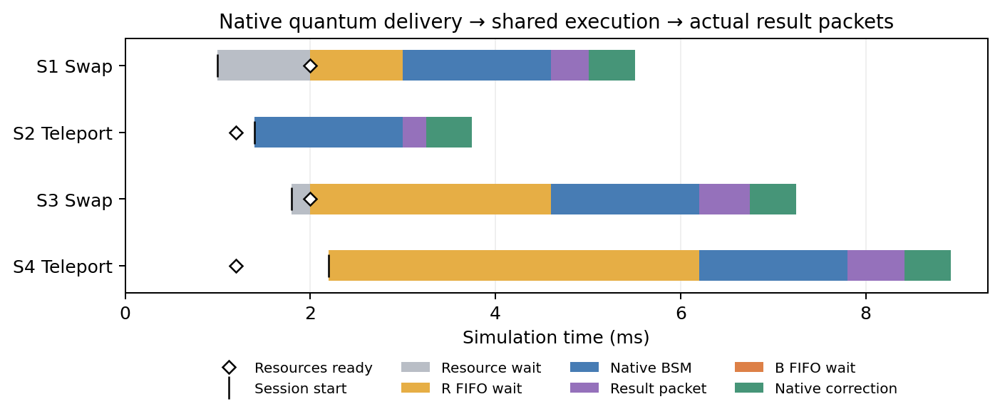

# QuCl v4 — Quantum-channel provisioning results

Actual NetSquid Network/Node/QuantumChannel delivery gates Q2NS BSM eligibility. Native R/B execution and actual ns-3 result packets are retained.

**Assumptions:** EPR/input creation at t=0; lossless delivery; ideal zero-delay readiness knowledge at R; fixed topology and allocated memory positions. No heralding/ACK protocol is simulated.

## Validation

- 20 provisioning tests + 258 existing tests = **278 PASS**.
- Zero-delay/noise-off delivery reproduces v3 timings and states (also checked with memory noise enabled).
- Five noiseless Teleport input states × 32 seeds = 160 transactions; all four branches covered for each input.
- Independent channel/program reference checks delivery, readiness, BSM/gate and correction states.
- Analytic channel depolarization and local-only T1 storage during transit are checked separately.
- Resource/processor wait separation, ready-order FIFO, same-time ties, classical isolation, R/B mixed contention, observer invariance and negative cases pass.
- Maximum density-matrix error: **4.44e-16**.

## New evaluation

4 RA/RB delay combinations × background off/on × depolarization 0/50 Hz × Swap/Teleport/mixed × seeds 7/11 = **96 runs, 192 transactions**. All runs pass packet FIFO, readiness/FIFO, ownership and independent state validation. Classical packet drops: 0.

This is a finite correctness/causality sweep. It does not supply population-performance confidence intervals. Channel propagation need not strictly increase BSM start when an existing processor wait masks it. Fidelity monotonicity is not an acceptance condition.

## Mixed scenario: resource wait and R wait

RA delay = 2 ms; RB delay = 1.2 ms; RB depolarization = 50 Hz; actual classical background traffic enabled. Teleport source/Alice stays at R. All durations below are ms.

| Session | Protocol | Session start | Resources ready | Resource wait | R wait | BSM start | Result delay | B wait | Completion |
|---:|---|---:|---:|---:|---:|---:|---:|---:|---:|
| 1 | swap | 1.000 | 2.000 | 1.000 | 1.000 | 3.000 | 0.412 | 0.000 | 5.512 |
| 2 | teleport | 1.400 | 1.200 | 0.000 | 0.000 | 1.400 | 0.250 | 0.000 | 3.750 |
| 3 | swap | 1.800 | 2.000 | 0.200 | 2.600 | 4.600 | 0.548 | 0.000 | 7.248 |
| 4 | teleport | 2.200 | 1.200 | 0.000 | 4.000 | 6.200 | 0.622 | 0.000 | 8.922 |

The earlier-starting Swap session waits for RA delivery while a ready Teleport session can use R. Queue entry is based on eligibility, not blocked by an unready session.

## Evidence and relation to v3

- [Validation summary](../results/provisioned-validation-summary.json)
- [Evaluation summary and raw-report paths](../results/provisioned-evaluation/summary.json)
- [Regression logs](../results/provisioned-regression/summary.json)
- [Model/implementation contract](../SPEC-PROVISIONED.md)
- [v3 freeze](../baselines/native-v3-freeze.json)

`RESULTS.md` and Figures 4–7 remain the published v3 native timed P5-B/cost results. They are not results for this provisioning model. This document and Figure 8 report fresh v4 runs.
