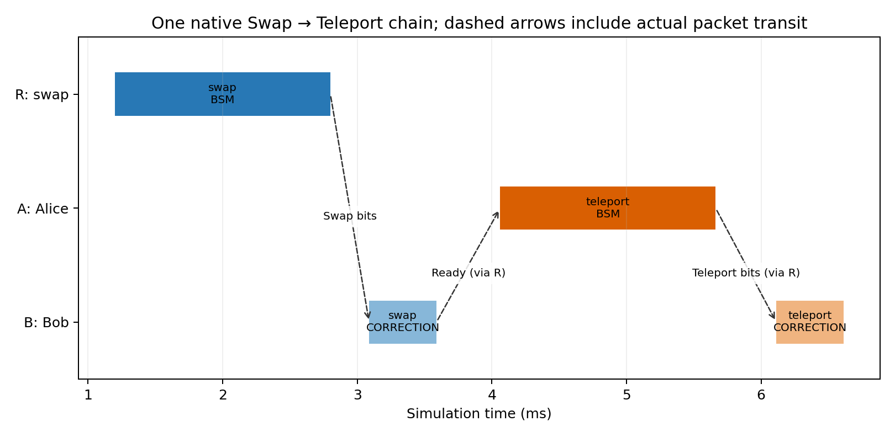
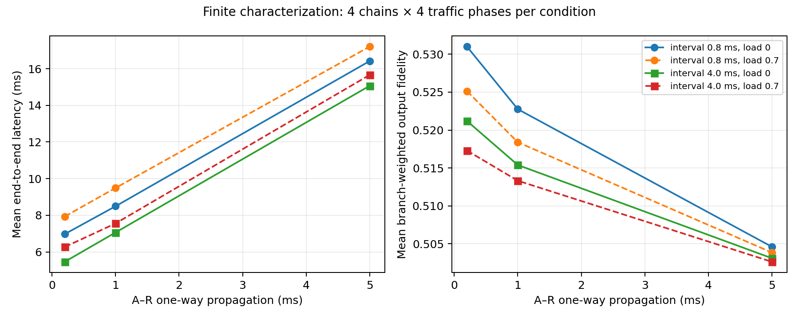

# Hybrid v5 — Swapping-assisted A→B teleportation

**Actual Swap output qubits are consumed by A’s TeleportationApp. All results below are new v5 runs.**

## Validation

- 307 total regression cases PASS (16 new + 291 preserved baseline cases).
- Five noiseless inputs (0, 1, +, −, +i), each covering all 16 joint Swap/Teleport BSM branches: 80 transactions; final fidelity ≈1.
- 48 characterization runs / 192 end-to-end chains; independent two-stage NetSquid reference, including native instruction checkpoints.
- Maximum density-matrix difference across characterization/branch/single evidence: 5e-16.
- Actual routed UDP, per-hop FIFO recurrence, native R/A/B processor FIFO, ready-before-teleport, same-object pair handoff, single consumption and sole NetSquid state ownership all pass.

## Single-chain timing

| Boundary | Simulation time (ms) |
|---|---:|
| Local start | 1.000000 |
| Elementary resources ready | 1.200000 |
| R swap BSM complete | 2.800000 |
| B swap correction complete / pair handoff | 3.588000 |
| Ready packet received at A | 4.061600 |
| A teleport BSM complete | 5.661600 |
| B teleport correction complete | 6.612800 |

Final completion: **6.6128 ms**; latency from the 1 ms local start: **5.6128 ms**.
The 0.4736 ms ready transit uses B→R→A. The 0.4512 ms teleport-result transit uses A→R→B.
These packet delays include both serialization and propagation on each hop.
Increasing A–R propagation from 0.2 to 1 ms keeps all swap checkpoints identical,
delays A’s readiness by 0.8 ms and final completion by 1.6 ms in the single-chain case.
Input and swapped-pair memory aging continue during that delay.

## Shared-resource burst case

Four starts at 0.8 ms intervals. A finite 20-packet R→B burst (100 μs interval, 1,000-byte payload) starts at 2 ms.
This controlled overload is a correctness case; no packet is dropped.

| Chain | R swap wait (ms) | A teleport wait (ms) | B swap wait (ms) | B teleport wait (ms) | End-to-end latency (ms) |
|---:|---:|---:|---:|---:|---:|
| 1 | 0.000 | 0.000 | 0.000 | 1.298 | 19.856 |
| 2 | 1.000 | 0.000 | 0.000 | 0.000 | 20.581 |
| 3 | 1.800 | 1.100 | 0.412 | 0.000 | 21.381 |
| 4 | 2.600 | 2.200 | 0.824 | 0.000 | 22.181 |

The routed ready packets and shared B corrections alter arrival spacing at A. The last two chains wait 1.1 and 2.2 ms for A’s processor.
Both protocols use the same B FIFO; their BSMs use the physically distinct R and A processors.

## Finite delay/load characterization

Fixed native T1=20 ms, T2=10 ms, quantum R→A/R→B delays 0.8/1.2 ms, channel depolarization 0 Hz.
Input +i and elementary EPRs are created at t=0. BSM/correction durations are 1.6/0.5 ms at both stages.
Classical links are 10 Mb/s; R–B propagation is 0.2 ms. Only R→B carries background traffic.
Each cell averages 4 chains × 4 periodic-background phases. Fidelity integrates the reference’s 16 joint BSM outcomes using Born probabilities.
The same fixed quantum seed is used in production runs; expected fidelity is not estimated from that one sampled branch.

| A–R delay (ms) | Start interval (ms) | R→B load | Mean latency (ms) | Mean expected output fidelity |
|---:|---:|---:|---:|---:|
| 0.2 | 0.8 | 0 | 6.975 | 0.5310 |
| 0.2 | 0.8 | 0.7 | 7.935 | 0.5251 |
| 0.2 | 4.0 | 0 | 5.463 | 0.5212 |
| 0.2 | 4.0 | 0.7 | 6.270 | 0.5173 |
| 1.0 | 0.8 | 0 | 8.494 | 0.5228 |
| 1.0 | 0.8 | 0.7 | 9.493 | 0.5184 |
| 1.0 | 4.0 | 0 | 7.063 | 0.5154 |
| 1.0 | 4.0 | 0.7 | 7.556 | 0.5133 |
| 5.0 | 0.8 | 0 | 16.413 | 0.5046 |
| 5.0 | 0.8 | 0.7 | 17.202 | 0.5039 |
| 5.0 | 4.0 | 0 | 15.063 | 0.5031 |
| 5.0 | 4.0 | 0.7 | 15.656 | 0.5026 |

No confidence interval or population claim is made from these four phases. Zero load makes phase inactive.
Longer start intervals also make later inputs/EPRs older because all are created at t=0; interval comparisons combine age and contention effects.
Fidelity monotonicity is not an acceptance criterion for T1/T2 noise. The defining checks are correct causal timing and reference-state agreement.

## Scope and reproducibility

- Fixed three-node lossless network; ideal initial EPR preparation and ideal zero-delay knowledge of elementary delivery at R.
- Swapped-pair readiness at A uses a real packet. B completes physical swap correction before advertising readiness.
- No photon-generation/heralding/retry, finite-memory admission, arbitrary protocol DAG, or Pauli-frame postponement.
- FIFO timing verification is conditional on observed enqueue/request order with separately checked cross-domain causal boundaries.
- v4 implementation and evaluation remain frozen. v5 state-reference errors do not measure v4/P5-B approximation errors.
- Plans: `scenarios/chained-evaluation.json`; raw reports: `results/chained-evaluation/*.json.gz`; per-chain metrics: [chains.csv](chains.csv).
- Branch seeds are selected for deterministic coverage, not performance sampling.
