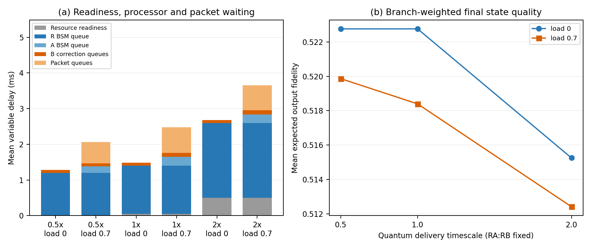

# Quantum-resource delivery timescale sensitivity

**Controlled execution-coupling study: fixed-ratio sensitivity, not hardware calibration or a population estimate.**

## Design fixed before execution

- Quantum RA/RB delivery delays: (0.4, 0.6), (0.8, 1.2), (1.6, 2.4) ms.
- Classical A–R delay 1 ms, R–B delay 0.2 ms, both 10 Mb/s; no synthetic command path.
- Four chains at 0.8 ms intervals, first start at 1 ms; input +i and elementary EPRs created at t=0.
- Native BSM/correction 1.6/0.5 ms per stage; memory T1/T2 20/10 ms.
- R→B periodic background offered load 0 or 0.7; 60 packets of 1,000-byte payload when enabled.
- Four paired traffic phases (101–104), quantum seed 7; all 16 joint reference branches enumerated for each chain.
- 24 new runs / 96 chains. The four zero-load phases repeat the same condition: only 15 distinct scale/load/phase conditions.
- Acceptance is causal/FIFO/resource/native-state correctness. No monotonicity or preferred direction of performance change is required.

## Verification

- All runs passed existing packet, resource, native-instruction and independent state-reference checks.
- Maximum density-matrix difference: 5e-16.
- All 8 baseline 1x runs exactly reproduce the original v5 snapshot, packet events, instruction traces, metrics and reference output.
- Paired end-to-end latency differences equal the sum of changes in resource wait, R/A/B processor wait and packet queueing, exactly in integer ns.
- Production implementation and prior evidence were left unchanged; source hashes were checked before and after execution.

## Results

| Quantum scale | Background load | Mean latency (ms) | Mean expected output fidelity | Mean R wait (ms) | Mean A wait (ms) | Mean B wait (ms) | Mean packet queue (ms) |
|---:|---:|---:|---:|---:|---:|---:|---:|
| 0.5 | 0 | 8.294 | 0.5228 | 1.200 | 0.000 | 0.081 | 0.000 |
| 0.5 | 0.7 | 9.077 | 0.5199 | 1.200 | 0.187 | 0.080 | 0.597 |
| 1 | 0 | 8.494 | 0.5228 | 1.350 | 0.000 | 0.081 | 0.000 |
| 1 | 0.7 | 9.493 | 0.5184 | 1.350 | 0.245 | 0.119 | 0.716 |
| 2 | 0 | 9.694 | 0.5153 | 2.100 | 0.000 | 0.081 | 0.000 |
| 2 | 0.7 | 10.670 | 0.5124 | 2.100 | 0.240 | 0.119 | 0.699 |



Panel (a) excludes fixed native execution and uncontended packet transit, whose sum is 7.0128 ms per chain.
The remaining bars sum to mean latency minus that fixed term. Panel (b) averages the branch-weighted fidelity across four chains and four traffic phases.
There are no confidence intervals; repeated zero-load phases do not provide independent evidence.

## Paired change from the 1x quantum delays

| Scale | Load | Mean change in latency (ms) | Mean change in packet queues (ms) | Chains with changed packet queue |
|---:|---:|---:|---:|---:|
| 0.5 | 0 | -0.200 | +0.000 | 0/16 |
| 0.5 | 0.7 | -0.415 | -0.118 | 15/16 |
| 2 | 0 | +1.200 | +0.000 | 0/16 |
| 2 | 0.7 | +1.177 | -0.017 | 12/16 |

## Main observations

- At load 0.7, halving delivery times reduces mean latency by 0.415 ms; mean packet queueing accounts for 0.118 ms of that reduction. The remaining change includes readiness and processor waits.
- Doubling delivery times increases mean latency by 1.177 ms while mean packet queueing decreases by 0.017 ms. Quantum delay does not map to an independent additive packet-delay term.
- All three loaded scales exhibit waiting at A and B in addition to R. The downstream interaction is present across the three tested delivery timescales.
- Without background traffic, the 0.5x and 1x cases differ in latency by 0.2 ms but have the same expected fidelity to numerical precision. Readiness and memory placement change together; latency alone does not determine accumulated memory noise.

## Interpretation boundaries

- Initial resource wait of the first chain is 0, 0.2 and 1.4 ms respectively. This exercises readiness before start and readiness after start.
- Load 0 means no background traffic. Protocol packets and the shared B processor can still contend.
- A 4 ms start interval in the original characterization is a lower offered-rate condition, not proof of zero downstream contention. R and A have distinct processors; their BSM durations should not be added to derive a universal contention threshold.
- Increasing quantum delivery delay also changes remote-memory placement time: quantum transit has no memory T1/T2 and channel depolarization is zero here. This experiment changes readiness and storage history together, not only a scheduler delay.
- Resource-delivery knowledge at R remains ideal and instantaneous; this is not a heralded entanglement-generation model.
- The RA:RB ratio remains 2:3. No robustness claim is made for other asymmetries, noise models, topologies or arrival processes.
- The 48-run main characterization remains valid as finite evidence; v4 ablations remain a separate controlled swapping workload and do not quantify approximation errors for this v5 chain.
- Parameter explanations describe what the existing settings exercise; they should not be presented as newly discovered evidence of hardware realism or as a retrospective claim of preregistered selection.

## Reproduction

From the ns-3 root, use a fresh output directory:

```bash
/home/ns3/qunet/bin/python contrib/cosim/experiments/run_chained_sensitivity.py \
  contrib/cosim/scenarios/chained-quantum-delay-sensitivity.json \
  --output-dir contrib/cosim/results/chained-quantum-delay-sensitivity-new
```

Raw reports, actual packet-generation timestamps, queue decomposition and paired changes are in
`results/chained-quantum-delay-sensitivity/`; each compressed report has a SHA-256 digest in `summary.json`.
The [result archive](../../baselines/chained-v5-quantum-delay-sensitivity-results.tar.gz) and
[file hashes](../../baselines/chained-v5-quantum-delay-sensitivity-results.json) preserve the successful run evidence and this figure.
