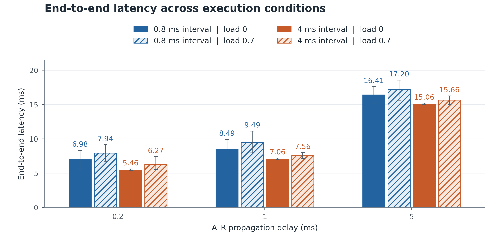
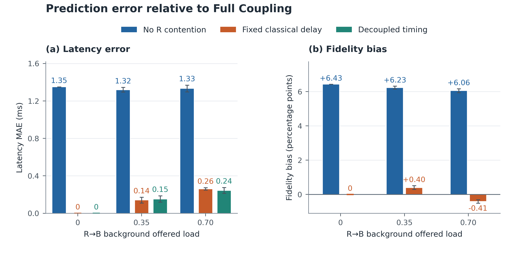

# QuCl 평가 — 그림 두 장과 검증 표 하나

**[두 페이지 PDF 열기](FIGURES.pdf)** · [LaTeX 원고](evaluation.tex) · [전체 수치 CSV](data/)
기존 검증 완료 데이터를 다시 집계한 결과이며, 이번 변경은 표현과 구성의 수정입니다.

## 파라미터 출처와 현재 결과의 범위

[문헌 설명·비교 표](physical-model.tex)와 [BibTeX](references.bib)를 원고 setup에 포함했습니다.
Liao (2022) Table 3와 Iqbal (2023) Table 3/Section 4의 문헌 profile은 CNOT 20 μs, H/X/Z 5 ns, 측정 3.7 μs, T1=10 h, T2=1 s입니다.
이 profile의 직렬 BSM 시간은 27.405 μs로 유도됩니다. **아래 결과는 기존 1.6 ms controlled profile의 결과이며, 문헌 profile로 재실험한 결과가 아닙니다.**
논문 제목·DOI와 인용 위치는 [README](README.md#문헌-기반-파라미터와-인용)에 정리했습니다.

## 검증은 표 하나로

| 항목 | 결과 |
|---|---|
| Noiseless: 6 inputs × 16 joint branches | 96 chains; min F ≈ 1; max ρ error 1.11e-16 |
| Native T1/T2: 6 inputs × 2 delays | 12 runs; max ρ error 3.33e-16 |
| 연쇄 실행 sweep | 48 runs / 192 chains; max ρ error 5e-16 |
| 자원·인과관계 | 같은 qubit 인계, 단일 소비, packet 수신 후 연산 시작 PASS |
| 별도 v4 FIFO 검증 | 500 requests / 12 workloads; timing error 0 ns |

## 그림 1 — 같은 조건을 바로 옆에서 비교

**색 = 시작 간격, 빗금 = background load 0.7.** 각 A–R delay에서 네 조건을 같은 축에 나란히 배치했습니다.
막대와 숫자는 평균, 오차막대는 4 chain positions × 4 phases의 관측 min–max입니다. 신뢰구간이 아닙니다.
시작 간격 0.8 ms / load 0에서 평균 latency는 **6.975 → 8.494 → 16.413 ms**입니다.
모든 자원은 t=0 생성이므로 시작 간격 비교에는 contention과 저장 age 변화가 함께 들어갑니다. Load 0의 phase 반복은 동일 조건입니다.

## 그림 2 — 어떤 단순화가 얼마나 틀리는가

**같은 load의 모델들을 나란히 비교합니다.** 왼쪽은 latency MAE, 오른쪽은 같은 0 기준축의 signed fidelity bias입니다.
오른쪽 단위는 percentage points, 즉 **100 × ΔE[F]**입니다. 상대적인 퍼센트 변화율이 아닙니다. Decoupled는 state를 예측하지 않아 오른쪽에서 제외합니다.
오차막대는 32 traffic-phase clusters의 95% bootstrap CI입니다. 두 calibration phase의 추정 불확실성은 포함하지 않습니다.

| Load 0.7, interval 0.8 ms | Latency MAE (ms) | Fidelity bias (pp) |
|---|---:|---:|
| No R contention | 1.334 | +6.06 |
| Fixed classical delay | 0.261 | -0.41 |
| Decoupled timing | 0.244 | not defined |

**핵심:** R 대기를 없애면 약 1.33 ms의 시간 오차와 +6.06 pp의 fidelity bias가 생깁니다. Fixed classical delay도 정확하지 않으며 bias는 부하에 따라 +/−로 바뀝니다.
R wait가 없는 2 ms interval에서는 No R Contention의 관측 시간·fidelity 오차가 0입니다. 이 대조 조건은 본문 한 문장과 CSV로 남겼습니다.

### 두 실험의 범위

- 그림 1: v5 Swap → A-to-B Teleport, correction 500 μs.
- 그림 2: 별도 v4 provisioned Swap, correction 50 μs로 B 경합 배제. 384 paired cases / model당 1,536 transactions. Target은 A–B Bell pair.
- 따라서 그림 2의 오차를 그림 1의 전체 workflow에 대한 오차로 해석하지 않습니다.

### 민감도는 그림을 늘리지 않고 한 문단으로

별도 24-run quantum-delivery sweep에서 load 0.7일 때 전달시간을 절반으로 줄이면 latency −0.415 ms, packet queue −0.118 ms였습니다. 두 배로 늘리면 latency +1.177 ms이나 packet queue는 −0.017 ms였습니다. 총지연은 각 항의 합이지만, quantum completion이 packet 생성시각을 바꾸므로 각 항을 독립적으로 예측할 수 없습니다.
이 비교는 RA:RB 비율 고정이며 readiness와 remote-memory placement가 함께 바뀝니다. 상세 조건·수치는 [sensitivity CSV](data/sensitivity_cells.csv)에 있습니다.

## 검산·재현

72개 raw report, v4 오차 4,608행, timing 500행을 대조했습니다. 원본 해시와 집계 검산은 [provenance.json](provenance.json), 재생성 명령은 [README](README.md)에 있습니다.
모든 입력/원본 데이터는 보존했습니다. 추가 시뮬레이션 실행은 하지 않았습니다.
