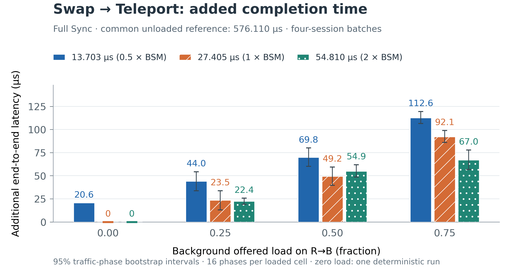
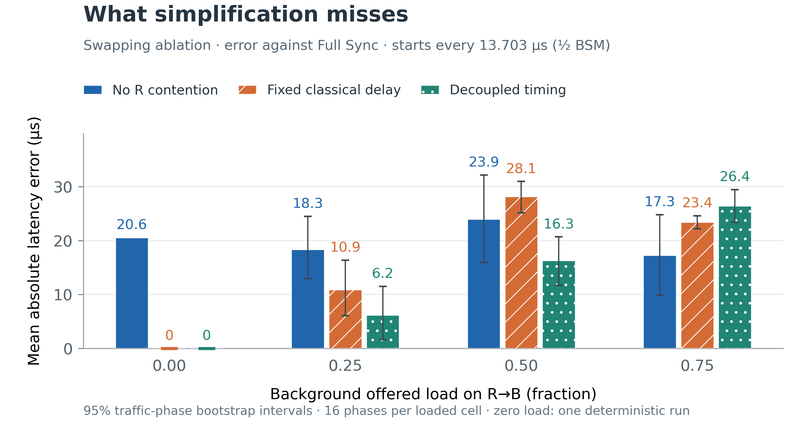

# QuCl — 문헌 기반 profile 재평가

**현재 결과는 Liao–Iqbal profile로 새로 실행했다. 기존 1.6 ms 결과와 분리한다.**

## 설정과 근거

| 항목 | 새 설정 | 근거 |
|---|---|---|
| CNOT / H / 개별 측정 | 20 μs / 5 ns / 3.7 μs | Liao Table 3; Iqbal Table 3 |
| X / Z | 각각 5 ns | Iqbal Table 3 |
| Memory T1 / T2 | 10 h / 1 s | Iqbal Section 4 |
| Gate depolarization p | 0.01 | Iqbal Section 4; 적용 위치는 아래 명시 |
| BSM / correction | 27.405 μs / 10 ns | 직렬 회로·고정 슬롯의 합 |
| 요청 간격 | 13.703 / 27.405 / 54.810 μs | BSM의 ½ / 1 / 2배; 반올림 +0.5 ns |
| R–B background load | 0 / 0.25 / 0.50 / 0.75 | 동일 간격의 부하 sweep |
| Classical link | 100 Mb/s, hop당 100 μs | controlled network 가정 |

문헌: [Liao et al., *Benchmarking of quantum protocols* (2022)](https://doi.org/10.1038/s41598-022-08901-x), [Iqbal et al., *Investigating Imperfect Cloning for Extending Quantum Communication Capabilities* (2023)](https://doi.org/10.3390/s23187891). 논문용 citation은 [references.bib](references.bib), 적용 설명은 [physical-model.tex](physical-model.tex)에 있다.

Native T1/T2와 함께 CNOT/H/X/Z의 각 operand에 p=0.01 depolarization을 적용했다. 적용 순서는 active memory noise → gate depolarization → ideal gate다. Measurement와 실행하지 않는 correction identity slot에는 storage noise만 적용했다. 이 noise 위치, 직렬 측정, 이상적인 초기화/readout, 무손실·무잡음 quantum transit은 명시적인 QuCl 가정이다. **문헌 기반 nominal processor이며 실제 NV 장비 재현을 주장하지 않는다.**

EPR과 입력 qubit은 t=0에 생성하고 native quantum delivery는 0.8/1.2 ms다. 첫 session은 2 ms에 시작하여 resource-ready 지연을 통제했다. 4개 session의 뒤쪽 요청은 t=0부터 더 오래 저장된 상태를 사용한다. Chain 성능 sweep의 입력은 `|+i⟩`이며, 6개 입력 상태의 correctness 검증과 구분한다. 100 Mb/s에서 swap result의 serialization은 8.8 μs이므로 가장 짧은 요청 간격보다 짧다. 1000-byte background packet은 1030 wire bytes이며 serialization 82.4 μs/설정 부하로 주기를 정했다. 부하는 background offered load이며 protocol packet까지 포함한 총 이용률이 아니다.

## 실행·검증

- 147개 조건: chain 147회 + swapping 모델 3종, 총 **588회 재실행**. Calibration 13회 별도.
- Chain 588 transactions; swapping 모델별 588 transactions.
- Noiseless 54회 / 324 chains: 6개 입력 × 16개 joint branch 모두 확인. 최소 fidelity 0.9999999999999998.
- 6개 noisy input × 2개 A–R delay = 12회 별도 검증. 전체 최대 density-matrix error **7.22e-16**.
- 기존 회귀 196개 + 평가 도구 38개 = **234 tests PASS**.
- 실제 ns-3 실행의 packet drop=0, Q2NS native qubit/state=0, chained 실행의 swapped pair 실제 객체 handoff를 검사했다. Fixed-Dc는 virtual transport다. 실행 소스와 원본 report 해시도 대조했다.

## 그래프 1 — Swap→Teleport의 추가 완료시간

[PDF](figures/fig1_chain_latency.pdf) · [PNG](figures/fig1_chain_latency.png)

**같은 load에서 세 막대는 요청 간격만 다르다.** Y축은 공통 무부하·비경합 완료시간 576.110 μs보다 추가된 시간이다. 모든 막대에 같은 기준을 사용하고 축은 0에서 시작한다. 아래 표에는 절대 완료시간을 함께 제시한다. Swap R BSM → R–B result → B correction → B–R–A readiness → Teleport A BSM → A–R–B result → B correction 전체를 포함한다. 측정 기준은 local session start부터 최종 teleported qubit usable까지다.

| Load | 13.703 μs 간격 | 27.405 μs 간격 | 54.810 μs 간격 |
|---:|---:|---:|---:|
| 0.0 | 596.7 | 576.1 | 576.1 |
| 0.25 | 620.2 | 599.6 | 598.5 |
| 0.5 | 645.9 | 625.3 | 631.0 |
| 0.75 | 688.7 | 668.2 | 643.1 |

단위 μs. 95% 구간과 각 대기시간 성분은 [chain_cells.csv](data/chain_cells.csv).

½T와 1T 간격에서는 R의 직렬 완료 일정이 같다. 두 조건의 평균 latency 차이 20.553 μs는 서로 다른 요청 시작시점에 따른 FIFO 대기시간을 반영한다. 실제 packet 생성시각 변화의 영향은 아래 No-R paired ablation에서 확인한다.

## 그래프 2 — 무엇을 단순화하면 오차가 생기는가

[PDF](figures/fig2_model_error.pdf) · [PNG](figures/fig2_model_error.png)

**Swapping을 분리한 paired ablation이며 chain 전체의 모델 비교가 아니다.** 요청 간격은 13.703 μs로 고정한다. No R contention은 R capacity 제약을 제거한 시각에 실제 packet을 다시 생성한다. Fixed classical delay는 별도 calibration 평균 result delay를 사용하고 R FIFO는 유지한다. Decoupled timing은 No-R의 result delay와 resource-eligible R FIFO wait를 합성하며 fidelity는 정의하지 않는다.

| Load | No R contention | Fixed classical delay | Decoupled timing |
|---:|---:|---:|---:|
| 0.0 | 20.55 (deterministic) | 0.00 (deterministic) | 0.00 (deterministic) |
| 0.25 | 18.32 [12.89, 24.49] | 10.89 [6.08, 16.37] | 6.17 [1.63, 11.49] |
| 0.5 | 23.94 [15.92, 32.17] | 28.15 [25.16, 30.95] | 16.27 [11.68, 20.67] |
| 0.75 | 17.28 [9.85, 24.79] | 23.40 [22.18, 24.59] | 26.44 [23.42, 29.43] |

Latency MAE, μs [95% interval]. Zero load는 결정론적 1회 결과다.

### 기대 fidelity 차이도 함께 확인

| Load | No R contention − Full | Fixed delay − Full |
|---:|---:|---:|
| 0.0 | 0.000039 (deterministic) | 0.000000 (deterministic) |
| 0.25 | 0.000037 [0.000032, 0.000043] | 0.000003 [-0.000003, 0.000010] |
| 0.5 | 0.000042 [0.000035, 0.000050] | -0.000011 [-0.000017, -0.000004] |
| 0.75 | 0.000036 [0.000029, 0.000043] | 0.000008 [0.000005, 0.000011] |

이 표의 fidelity는 swapping output과 목표 Bell state의 fidelity이며, 각 timing에서 네 측정 분기의 확률 가중 기대값이다. 같은 seed의 단일 branch 차이를 평균 fidelity 효과로 해석하지 않는다. 긴 T2와 μs 단위 연산에서는 추가 대기로 인한 fidelity 변화가 이전 illustrative profile보다 작을 수 있다. 서로 다른 물리 모델의 수치를 시스템 개선율로 비교하지 않는다.

### Cross-domain timing의 직접 확인

588개 paired transaction에서 `Decoupled latency error = No-R result delay − Full result delay`를 확인했다. 따라서 quantum wait를 제거하면 뒤쪽 packet이 다른 background queue 구간을 만나며, 그 지연을 독립적으로 재사용할 수 없다.

예: load=0.25, 간격=13.703 μs, phase seed=1001, session=4. Full의 R wait는 41.106 μs지만 Full과 No-R latency는 모두 184.838 μs다. No-R의 result delay가 정확히 41.106 μs 늘어나 상쇄했다. 이 사례는 대표 평균이 아닌 인과관계 확인용 trace다.

### 저장시간과 quantum state의 연결

단일 chain의 A–R propagation을 100→500 μs로 늘린 검증에서는 완료시간이 576.110→1376.110 μs로 늘고, `|+i⟩`의 기대 fidelity는 0.957105→0.956374로 변했다. A–R을 readiness와 teleport result가 각각 지나므로 추가 시간은 800 μs다. 두 상태 모두 독립 reference와 비교했다. 6개 입력의 수치는 [six_state_noise.csv](data/six_state_noise.csv)에 있다.

## 해석 범위

- Loaded cell마다 독립 traffic phase 16개. 한 phase의 4개 session을 먼저 평균내고 phase를 10,000회 bootstrap했다.
- Quantum fidelity는 16개(chain) 또는 4개(swap) 분기를 정확히 열거했다. Quantum seed 반복을 독립 traffic 표본으로 세지 않는다.
- Calibration은 load별 별도 phase 4개(무부하 1개), 요청 간격 20×BSM이다. 모든 calibration transaction은 background traffic 종료 전에 완료한다. CI는 이 calibration에 조건부다.
- 요청 간격=BSM 조건은 정확히 정렬된 결정론적 경계 조건이다. 일반 확률 도착의 안정성/이용률 주장이 아니다.
- 모든 실행은 4-session finite batch이며 steady-state throughput, 장비 fidelity 또는 임의 network로 일반화하지 않는다.
- F_min=0.5, deadline=5 ms는 보존한 audit 기준이다. 이번 profile의 주요 결과는 latency 및 모델 오차이며 서비스 실패 일반화에 사용하지 않는다.

원본: [literature-evaluation-v1/summary.json](../../results/literature-evaluation-v1/summary.json). 모든 aggregate: [data/](data/). 재현법: [README](README.md).
