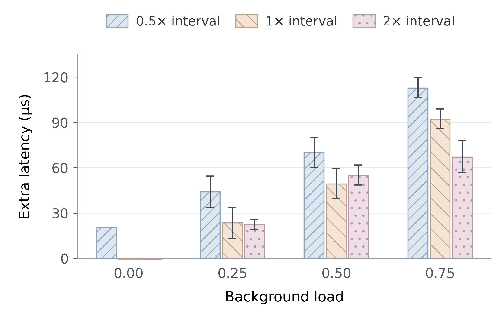
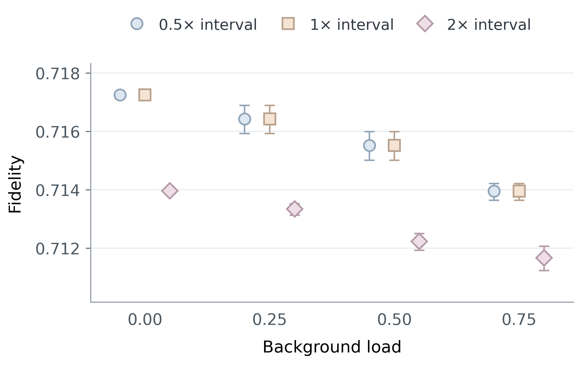
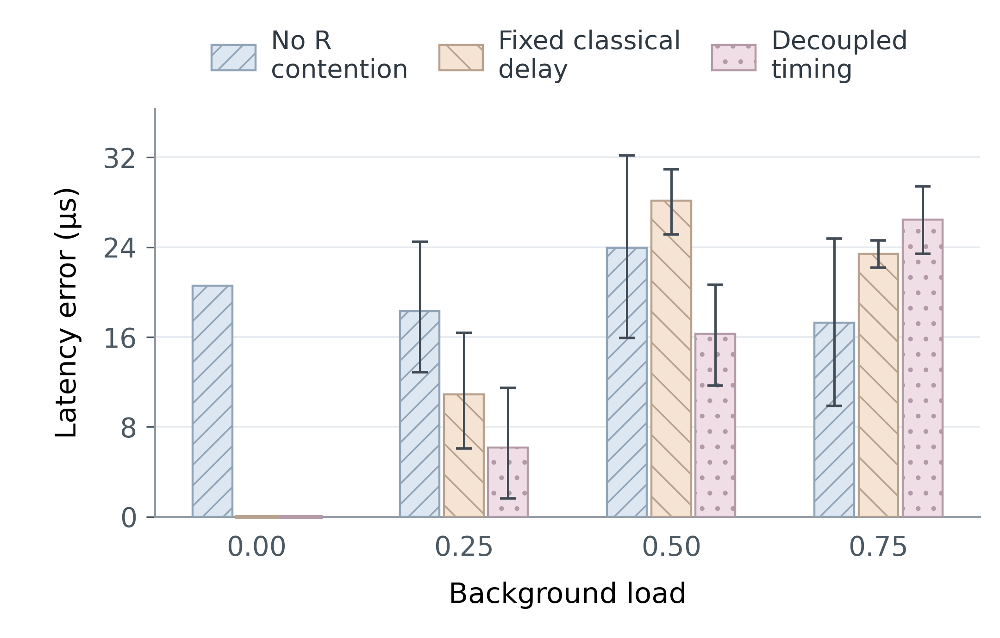

# QuCl — 20/10 ms memory 재평가: Fig. 3–5

**새 문헌의 gate 시간 + 기존 T1=20 ms·T2=10 ms로 모두 새로 실행했다.**
이전 T1=10 h·T2=1 s 결과는 [evaluation-long-memory](../evaluation-long-memory/RESULTS.md)에 보존했다.

## 설정과 출처

| 항목 | 설정 | 근거 |
|---|---|---|
| CNOT / H / 측정 | 20 μs / 5 ns / 3.7 μs | Liao Table 3; Iqbal Table 3 |
| X / Z | 각각 5 ns | Iqbal Table 3 |
| Memory T1 / T2 | **20 ms / 10 ms** | Bugalho Fig. 3a의 사용 선례; 모든 memory에 균일 적용은 QuCl 가정 |
| Gate depolarization | p=0.01 유지 | Iqbal Section 4; 각 operand에 독립 적용 |
| BSM / correction | 27.405 μs / 10 ns | 직렬 회로와 고정 correction slot의 합 |
| 시작 간격 | 13.703 / 27.405 / 54.810 μs | BSM 실행시간 기준 0.5× / 1× / 2× 간격 |
| Background load | 0 / 0.25 / 0.50 / 0.75 | R→B, 100 Mb/s, 100 μs/hop |

문헌: [Liao 2022](https://doi.org/10.1038/s41598-022-08901-x), [Iqbal 2023](https://doi.org/10.3390/s23187891), [Bugalho 2023](https://doi.org/10.1038/s41534-023-00773-x). 각 항목의 출처가 있는 **조합형 추상 모델**이며 한 장비의 재현이 아니다. Gate noise의 적용 위치, ideal source/readout, lossless/noiseless quantum transit은 [evaluation.tex](evaluation.tex)에 명시했다.

**0.5×·1×·2×는 workflow 시작 간격**이다. 기준 BSM 실행시간은 27.405 μs이고, 모든 workflow에서 BSM은 온전히 실행된다. 0.5× 간격에서 R 대기가 생기며, 이 실험의 1×·2× 간격에서는 R 대기가 없다.

입력과 EPR 생성은 t=0, quantum delivery는 0.8/1.2 ms, 첫 시작은 2 ms다. 모든 입력 상태마다 별도 4-session batch를 실행했다. 따라서 여섯 입력 때문에 하나의 batch에 24개 session을 넣거나 contention을 바꾸지 않았다. 입력 qubit은 t=0부터 memory에 있고, 전송 중인 EPR half는 quantum channel 모델을 따른다.

## 새 실행 및 검증

- 147개 workload 조건 × 6개 입력 = **882 chain runs / 3528 transactions**.
- Swapping Full/No-Dq-R/Fixed-Dc를 모두 재실행: 모델별 **588 transactions**.
- 합계 **1323 evaluation runs**, 별도 calibration **13 runs**.
- Noiseless **324 chains**, 6개 입력 × 16개 joint branch; noisy 추가 **12 runs**.
- 최대 density-matrix error **9.99e-16**; 회귀 **240개 항목 검증 완료**.
- 전체 회귀의 최초 2개 보존 검사는 이전 문서에 추가된 안내 링크 때문에 실패했다. 보존 문서를 원복하고 두 검사를 재실행해 통과했다. 원본 실패 로그와 재검사 로그를 provenance에 함께 기록했다.
- 여섯 입력 사이의 latency/decomposition 동일성, 실제 swapped-pair handoff, native Q2NS state/qubit=0, packet drop=0을 검사했다.

### Fidelity API 통일

Co-simulation과 두 reference 모두 **NetSquid `qapi.fidelity(..., squared=True)`**를 사용한다. 기존 보고서의 최종 density matrix를 native API에 입력해 모든 평가 분기의 fidelity를 다시 계산하고 Fig. 4의 집계를 갱신했다. 이는 저장된 상태의 metric 재계산이며 network/quantum evolution을 새로 실행한 것은 아니다. 원본 시각·상태·보고서와 생성 당시의 source hash는 보존했다.

- Native API로 대조한 출력 상태 **120,736개**; 최대 차이 **4.44e-16**.
- Native API 변경 후 평가 회귀 **44개 PASS**. 물리 모델·실행 코드는 fidelity API 호출 두 곳 외에는 바뀌지 않았다.
- [Native metric 검증 및 분기별 값](data/native-fidelity-audit.json)에 변경 전후 해시와 계산 결과를 기록했다.

## Fig. 3 — Swap→Teleport 완료시간

공통 무부하·비경합 기준 **576.110 μs**를 뺀 추가 완료시간이다. 측정 구간은 local session start부터 최종 Bob output usable까지다. 아래 표는 절대 latency다.

| Background load | 0.5× 간격 (μs) | 1× 간격 (μs) | 2× 간격 (μs) |
|---:|---:|---:|---:|
| 0.00 | 596.663 | 576.110 | 576.110 |
| 0.25 | 620.152 | 599.599 | 598.504 |
| 0.50 | 645.901 | 625.348 | 630.983 |
| 0.75 | 688.729 | 668.176 | 643.122 |

0.5× 간격과 1× 간격에서는 R의 직렬 완료 일정이 같다. 평균 latency 차이 20.553 μs는 요청 시작시점과 FIFO 대기 차이다. 뒤쪽 packet 생성시각을 실제로 바꾸는 개입은 Fig. 5의 No-R 비교다.

## Fig. 4 — 최종 Teleportation 충실도

**Bob의 출력 상태와 최초 입력 상태의 squared fidelity**를 평가했다. 각 `0, 1, +, −, +i, −i` 입력에서 16개 joint branch를 확률 가중하고, 여섯 상태와 네 session을 phase 안에서 동일 가중 평균했다. 그래프는 절대 fidelity이며 세 조건의 차이를 읽을 수 있도록 Y축 범위를 명시적으로 확대했다.

| Background load | 0.5× 간격 | 1× 간격 | 2× 간격 |
|---:|---:|---:|---:|
| 0.00 | 0.717247 | 0.717247 | 0.713963 |
| 0.25 | 0.716431 | 0.716431 | 0.713343 |
| 0.50 | 0.715524 | 0.715524 | 0.712230 |
| 0.75 | 0.713952 | 0.713952 | 0.711669 |

**동일 latency에서도 fidelity는 다를 수 있다.** 무부하의 1×·2× 간격 조건은 모두 평균 latency 576.110 μs지만, 평균 fidelity는 각각 0.717247, 0.713963다. 모든 자원을 t=0에 만들기 때문에 2× 간격 조건의 뒤쪽 session은 시작 전에 이미 더 오래 저장된 상태를 사용한다. 요청 이후 latency만으로 최종 quantum quality를 판단할 수 없다는 예다.

0.5× 간격과 1× 간격은 절대 완료 일정과 자원 생성시각이 같아 fidelity도 수치 오차 내에서 같다. 간격을 늘리면 queue wait와 t=0 이후의 자원 저장시간이 함께 달라진다. 따라서 이 그림에서 간격 간 차이를 quantum queue만의 효과로 해석하지 않는다. 부하 비교는 같은 간격에서 수행한다. 입력별 결과와 95% CI는 CSV에 보존했다.

## Fig. 5 — 단순화 모델 예측 오차

**Swapping 구간의 paired ablation**이다. 전체 Swap→Teleport chain 모델 비교와 구분한다. 간격은 13.703 μs다. No-Dq-R은 R capacity만 제거하고 변경된 시각에 실제 packet을 다시 생성한다. Fixed-Dc는 별도 calibration 평균 result delay와 quantum FIFO를 사용한다. Decoupled는 No-R result delay와 독립 FIFO wait를 합성하며 fidelity는 정의하지 않는다.

| Load | No R contention MAE (μs) | Fixed-Dc MAE (μs) | Decoupled MAE (μs) |
|---:|---:|---:|---:|
| 0.00 | 20.55 (deterministic) | 0.00 (deterministic) | 0.00 (deterministic) |
| 0.25 | 18.32 [12.89, 24.49] | 10.89 [6.08, 16.37] | 6.17 [1.63, 11.49] |
| 0.50 | 23.94 [15.92, 32.17] | 28.15 [25.16, 30.95] | 16.27 [11.68, 20.67] |
| 0.75 | 17.28 [9.85, 24.79] | 23.40 [22.18, 24.59] | 26.44 [23.42, 29.43] |

### Swapping Bell-state fidelity bias (model − Full Sync)

| Load | No R contention | Fixed-Dc |
|---:|---:|---:|
| 0.00 | 0.002723 (deterministic) | 0.000000 (deterministic) |
| 0.25 | 0.002572 [0.002215, 0.002979] | 0.000214 [-0.000189, 0.000667] |
| 0.50 | 0.002933 [0.002409, 0.003471] | -0.000737 [-0.001147, -0.000289] |
| 0.75 | 0.002491 [0.002004, 0.002982] | 0.000539 [0.000317, 0.000768] |

실제 trace 예: load=0.25, phase seed=1001, session=2에서 R 대기 13.702 μs를 제거해도 result 전달 지연이 13.702 μs 증가해 latency는 194.644 μs로 같다. 평균 효과가 아니라 인과관계를 보여주는 사례다.

### 별도 memory-aging 검증

단일 chain의 A–R propagation만 100→500 μs로 바꾼 6입력 검증에서 최종 평균 fidelity는 **0.720624 → 0.695879**였다. 완료시간은 576.110→1376.110 μs다. Readiness와 teleport result가 각각 A–R을 지나 추가 시간은 800 μs이며, 두 조건의 state는 모두 독립 reference와 일치한다. 이는 별도 지연 개입 검증이며 Fig. 4의 load sweep 데이터와 섞지 않는다.

## 통계와 해석 범위

- Loaded cell마다 독립 traffic phase 16개. 무부하 phase는 의미가 없어 1회이며 CI를 그리지 않는다.
- 여섯 입력과 네 session을 phase 안에서 평균한 뒤 phase를 10,000회 bootstrap했다. 입력 6개를 독립 traffic 표본으로 세지 않는다.
- Fidelity는 joint branch 확률 가중 기대값이다. Quantum seed 반복 평균이 아니다.
- Calibration phase 4개/loaded condition은 test와 분리했다. CI는 고정된 calibration에 조건부다.
- T1/T2 변경으로 시간 차이가 커졌다고 주장하지 않는다. 고정 duration/고정 packet size 구조에서 memory는 state만 바꿀 수 있다.
- Fmin=0.5, deadline=5 ms는 감사용 기준으로 유지했다. Fidelity가 더 낮다고 곧바로 service failure 주장으로 바꾸지 않는다.
- 유한 4-session batch·고정 topology·균일 memory의 결과이며 단일 장비 calibration이나 정상상태 성능 결과가 아니다.

원본: [새 summary](../../results/memory-evaluation-v1/summary.json). 입력별 원시값과 집계값: [data/](data/). 재현 방법: [README](README.md).
